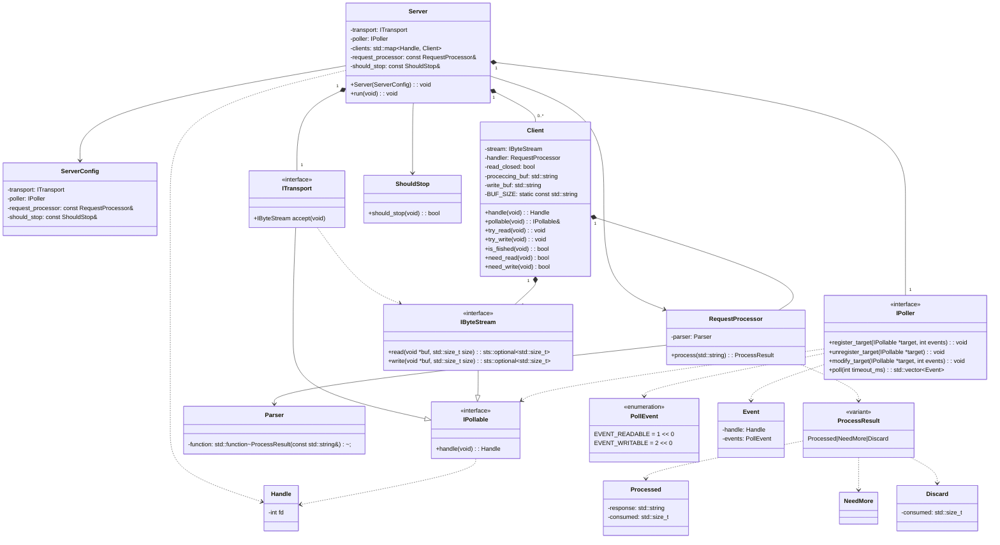

# Architecture

```mermaid
classDiagram

%% Server Module
	class Server {
		+Server(ServerConfig): void
		+run(void): void
		-transport: ITransport
		-poller: IPoller
		-clients: std::map~Handle, Client~
		-request_processor: const RequestProcessor&
		-should_stop: const ShouldStop&
	}

	Server --> ServerConfig
	Server  "1" *-- "1" ITransport
	Server  "1" *-- "1" IPoller
	Server "1" *-- "0..*" Client
	Server ..> Handle
	Server --> RequestProcessor
	Server --> ShouldStop

	class ServerConfig {
		-transport: ITransport
		-poller: IPoller
		-request_processor: const RequestProcessor&
		-should_stop: const ShouldStop&
	}

	class ShouldStop {
		+should_stop(void): bool
	}

%% Transport Module

	class ITransport {
		<<interface>>
		+IByteStream accept(void)
	}

	ITransport --|> IPollable
	ITransport ..> IByteStream

%% Client Module

	class Client {
		+handle(void): Handle
		+pollable(void): IPollable& 
		+try_read(void): void
		+try_write(void): void
		+is_fiished(void): bool
		+need_read(void) bool
		+need_write(void) bool
		-stream: IByteStream
		-handler: RequestProcessor
		-read_closed: bool
		-proceccing_buf: std::string
		-write_buf: std::string
		-BUF_SIZE: static const std::string
	}

	Client "1" *-- "1" IByteStream
	Client "1" *-- "1" RequestProcessor

%% Application Protcol Processor(RequestProcessor) Module

	class RequestProcessor {
		-parser: Parser
		+process(std::string): ProcessResult
	}


	class Parser {
		-function: std::function~ProcessResult(const std::string&)~;
	}

	RequestProcessor ..> ProcessResult
	RequestProcessor --> Parser

	class ProcessResult {
		<<variant>>
		Processed|NeedMore|Discard
	}

	ProcessResult ..> Processed
	ProcessResult ..> NeedMore
	ProcessResult ..> Discard

	class Processed {
		-response: std::string
		-consumed: std::size_t
	}

	class NeedMore {}

	class Discard {
		-consumed: std::size_t
	}


%% ByteStream Module

	class IByteStream {
		<<interface>>
		+read(void \*buf, std::size_t size): sts::optional~std::size_t~
		+write(void \*buf, std::size_t size): sts::optional~std::size_t~
	}

	IByteStream --|> IPollable

%% Poller Module

	class IPoller {
		<<interface>>
		+register_target(IPollable \*target, int events): void
		+unregister_target(IPollable \*target): void
		+modify_target(IPollable \*target, int events): void
		+poll(int timeout_ms): std::vector~Event~
	}

	IPoller ..> IPollable
	IPoller ..> PollEvent
	IPoller ..> Event

	class IPollable {
		<<interface>>
		+handle(void): Handle
	}

	IPollable ..> Handle

	class Event {
		-handle: Handle
		-events: PollEvent
	}

	class Handle {
		-int	fd
	}

	class PollEvent {
		<<enumeration>>
		EVENT_READABLE = 1 << 0
		EVENT_WRITABLE = 2 << 0
		<!-- EVENT_ERROR -->
	}

```
